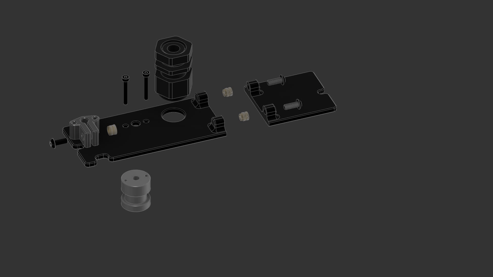

# Voron 0 Cable Gland
This mod enables using a Cable Gland for better sealing of the chamber.  
It requires removing the motor panel and the strain relief on the back.

You'll need to print a new motor panel. It is split in 2 to be printable on a Voron 0.  
The motor panel is based on the excellent work by zruncho3d on the DoubleDragon.

## BOM:

| Part                          | Amount |
|-------------------------------|--------|
| M3x8 BHCS                     | 3      |
| M3x4x5 Heat set inserts       | 3      |
| M2x16 BHCS/SHCS               | 2      |
| Phaetus Dragon Bowden Adapter | 1      |
| Cable Gland                   | 1      |

You should use [This type of cable glands](https://www.amazon.com/gp/product/B077R1RT2T).

## Assembly

1. Add 2 Heat-set inserts to the A panel.
2. Connect the B panel to the A panel with 2 M3x8 screws.
3. Add a heat-set insert to the bowden clip and clamp it lightly with an M3x8 screw.
4. Add the cable gland to the panel.
5. Add the bowden adapter and clip, connecting them with the M2x16 screws.
6. Finally, flip the panel and attach instead of the original motor panel.
7. Route all your electronics (and bowden tube) through the new bowden tube adapters and cable gland
8. Tighten the bowden clip so it holds the tube, but not so tight that it prevents the filament from moving.